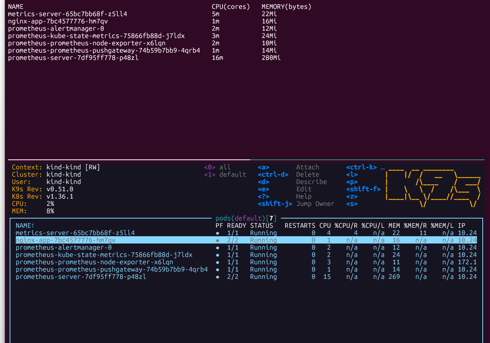
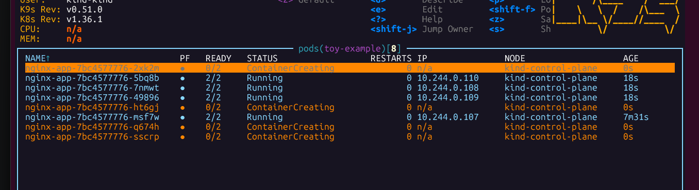

# Autoscaling with K8s Event Driven Autoscaler 

> Done for a basic web-app with Prometheus-based metric observation, and Kind (K8s in Docker), so that this can be run on a personal computer. Needs at least 8GB RAM and sufficient disk space (>64GB).

1. Run Minikube/Kind or equivalent.
    - `kind create cluster` OR `minikube start`
    - To view cluster information that you have just spawned: `kubectl cluster-info --context kind-kind`
2. Helm commands for loading Prometheus and KEDA. Helm is a package manager with commonly used manifests pre-made, similar to doing a **pip install**.
    - `helm repo add ` AND `helm repo update`
    - `helm install ...` 
> Normally, each service will be in its own namespace. Prometheus normally can be in a namespace called `monitoring`, KEDA is in a namespace of the same name `keda`, and the app will be in its name's namespace, or in `default`.
3. Kubectl
    - `kubectl apply -f <config-map>`
    - `kubectl apply -f deployment.yaml`
    - `kubectl edit cm prometheus-server`
    > And then change the fields data.prometheus.global.* all to 10 seconds.

> Important note: Prometheus scrapes metrics from the running application. Which is THEN used by KEDA to make decisions on if scaling up/down is required. It is crucial to match the frequency of fetching info in Prometheus and KEDA.

Prometheus is scraping from the deployment.yaml internally to get metrics. Which KEDA eventually looks at to do its autoscaling things. In Prometheus, this is given as `evaluation_interval` and `scrape_interval`, which can both be set to 10s (default: 1min, which is very slow).

In KEDA, this is controlled by the `pollingInterval` and `cooldownPeriod` (time it waits before scaling back down to lower resources). 
- `pollingInterval` is 15 seconds by default. Keep it that way. 
- `cooldownPeriod` is 300 seconds by default (5 mins, again too slow!). Set this to 120 seconds (2 mins).

> Second important note: There is no single configuration for getting the right cooldownPeriod, max/min replicas, evaluation_interval etc. It varies based on the requirements, or how big the application is, or how expensive it is to fetch metrics constantly, or how much time it takes to start/stop pods.

To see status if the deployment pod is spawned correctly: `kubectl get pods` (OR much better: **k9s**)

4. Continued Kubectl ...
    - Run the service (it serves the nginx-app): `kubectl apply -f service.yaml`
    - `kubectl port-forward <nginx-app-...> 9090` AND `kubectl port-forward service/nginx-app 8080:80`
    > One can run `kubectl port-forward <nginx-app> 9113` to see the scrapable metrics. It should have a /metrics endpoint if you visit localhost:9113.
    - Run the ScaledObject `kubectl apply -f httpautoscaling.yaml`, used by KEDA.

In all of the previously mentioned commands, make sure to indicate the particular namespace, by `kubectl -n <namespace>` if you wish to run this deployment separate to your other projects. It can be good to separate your deployments by their own namespaces, instead of `default`.

5. Run the command to simulate heavy traffic.
    - `hey -z 2m -c 20 http://localhost:8080`
    > The command means simulating requests for 2 minutes, from 20 concurrent request points, at the 8080 address (where the app is served).

Inspect with k9s and localhost:9090/query (Prometheus) to see the traffic increasing! On k9s, you should see more clusters spawn up.

Normal:

Higher Traffic:
